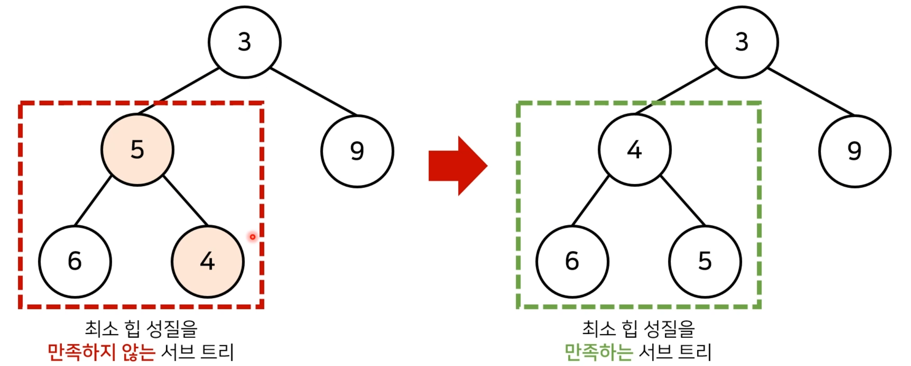

## 스택_큐

<br/>

<!-- TOC -->

- [스택_큐](#%EC%8A%A4%ED%83%9D_%ED%81%90)
- [스택stack](#%EC%8A%A4%ED%83%9Dstack)
    - [스택 구현](#%EC%8A%A4%ED%83%9D-%EA%B5%AC%ED%98%84)
- [큐queue](#%ED%81%90queue)
    - [큐 구현](#%ED%81%90-%EA%B5%AC%ED%98%84)
- [우선순위 큐  priority Queue](#%EC%9A%B0%EC%84%A0%EC%88%9C%EC%9C%84-%ED%81%90--priority-queue)
    - [구현 방법](#%EA%B5%AC%ED%98%84-%EB%B0%A9%EB%B2%95)
    - [힙의 특징](#%ED%9E%99%EC%9D%98-%ED%8A%B9%EC%A7%95)
    - [완전 이진 트리](#%EC%99%84%EC%A0%84-%EC%9D%B4%EC%A7%84-%ED%8A%B8%EB%A6%AC)
    - [최소 힙 구성 함수 Min-Heapify](#%EC%B5%9C%EC%86%8C-%ED%9E%99-%EA%B5%AC%EC%84%B1-%ED%95%A8%EC%88%98-min-heapify)
        - [힙에 원소가 삽입될 때](#%ED%9E%99%EC%97%90-%EC%9B%90%EC%86%8C%EA%B0%80-%EC%82%BD%EC%9E%85%EB%90%A0-%EB%95%8C)
        - [힙에 원소가 제거될 때](#%ED%9E%99%EC%97%90-%EC%9B%90%EC%86%8C%EA%B0%80-%EC%A0%9C%EA%B1%B0%EB%90%A0-%EB%95%8C)
    - [힙 구현 예제](#%ED%9E%99-%EA%B5%AC%ED%98%84-%EC%98%88%EC%A0%9C)

<!-- /TOC -->

<br/>

## 스택(stack)

- 가장 마지막 들어온 데이터가 우선적으로 삭제 (LIFO)
    - 박스를 쌓는(stack) 상황을 생각하면 된다
- 빈 스택에서 원소를 추출하려 하면 stack underflow, 스택이 넘치는 경우 stack overflow라고 한다.

<br/>

### 스택 구현

- 따로 라이브러리가 존재하지는 않고 리스트를 스택과 같이 사용하면 된다
- 단순한 리스트 메서드(append, pop)을 사용해 구현한다
    - `append(data)` : data를 스택 맨 위에 삽입
    - `pop()` : 스택 맨 위에 있는 값을 삭제 후 반환

```python
stack = []

stack.append(5)
stack.append(2)
stack.append(3)
stack.append(7)
stack.pop()
stack.append(1)
stack(4)
stack.pop()

print(stack) #[5, 2, 3, 1]
```

<br/>

## 큐(queue)

- 먼저 들어온 데이터가 먼저 나가는 형식(FIFO)
    - 줄을 서서 기다리는 것, 입구와 출구가 모두 뚫려 있는 터널과 같은 형태로 생각하면 된다
- 보통 `front` 를 맨 처음에 들어온 데이터, `rear` 를 맨 마지막에 들어온 데이터라고 한다.

<br/>

### 큐 구현

- 파이썬의 경우 colleqtion.deque 라이브러리가 있고 양방향에서 데이터를 처리할 수 있는 자료구조이기 때문에 데이터를 처리하는 속도가 매우 빠르므로 이를 자주 사용한다.

```python
from collections import deque
 
# deque 선언
dq = deque([])
 
# deque에 데이터 추가
dq.append(1)
dq.append(2)
dq.append(3)
dq.append(4)
print(dq)  # deque([1,2,3,4])
 
# deque의 첫번째 원소 제거
print(dq.popleft()) # 1
print(dq.popleft()) # 2
print(dq.popleft()) # 3
print(dq.popleft()) # 4
print(dq)# deque([])
```

<br/>

## 우선순위 큐 ( priority Queue)

- 우선순위 큐는 우선순위가 가장 높은 데이터를 먼저 삭제하는 자료구조
- 데이터를 우선순위에 따라 처리하고 싶을 때 사용

| 자료구조 | 추출되는 데이터 |
| --- | --- |
| 스택(Stack) | 가장 나중에 삽입된 데이터 |
| 큐(Queue) | 가장 먼저 삽입된 데이터 |
| 우선순위 큐(Prioirity Queue) | 가장 우선순위가 높은 데이터 |

<br/>

### 구현 방법

1. 단순 리스트를 이용해여 구현
2. 힙(heap)을 이용하여 구현
- 데이터의 개수가 N개일 때 구현 방식에 따른 시간 복잡도

| 우선순위 큐 구현 방식 | 삽입 시간 | 삭제시간 |
| --- | --- | --- |
| 리스트 | O(1) | O(N) |
| 힙(Heap) | O(logN) | O(logN) |
- 단순히 N개의 데이터를 힙에 넣었다가 모두 꺼내는 작업은 정렬과 동일 (힙 정렬)
    - 이 경우 시간 복잡도는 O(NlogN)
    

<br/>

### 힙의 특징

- 힙은 완전 이진 트리 자료구조의 일종
- 힙에서는 항상 루트 노드(root node)를 제거


- **최소 힙(min heap)**
    - 부모 노드의 키값이 자식 노드의 키값보다 항상 작은 힙
    - 따라서 값이 작은 데이터가 우선적으로 제거
- **최대 힙(max heap)**
    - 부모 노드의 키값이 자식 노드의 키값보다 항상 큰 힙
    - 따라서 값이 큰 데이터가 우선적으로 제거

<br/>

### 완전 이진 트리

- 완전 이진 트리란 루트 노드부터 시작하여 왼쪽 자식 노드, 오른쪽 자식 노드 순서로 데이터가 차례대로 삽입되는 트리이다

<br/>

### 최소 힙 구성 함수 Min-Heapify()

- 일반적으로 힙을 구성하기 위한 함수는 heapify라고 부르며 상향식 하향식으로 구현할 수 있다. 본 예제에서는 상향식 구현을 다룬다.



- 상향식 - 부모 노드로 거슬러 올라가며 부모보다 자신의 값이 더 작은 경우에 위치를 교체한다
- 위 그림에서 5와 4가 최소 힙 성질을 만족하고 있지 않고 있기 때문에 heapify를 통해 정렬됨을 볼 수 있다

<br/>

#### 힙에 원소가 삽입될 때

- 새로운 원소가 삽입되었을 때 O(logN) 시간복잡도로 힙 성질을 유지하도록 할 수 있다

#### 힙에 원소가 제거될 때

- 원소가 제거되어 ㅆ을 때 O(logN) 시간 복잡도로 힙 성질을 유지하도록 할 수 있다
    - 원소를 제거할 때는 가장 마지막 노드가 루트 노드의 위치에 오도록 하고 그 상태에서 하향식으로 heapify를 수행하면 된다.

<br/>

### 힙 구현 예제

- 우선순위 큐 라이브러리를 활용
```python
import sys
import heapq  #파이썬의 경우 min_heap 형태로 동작하여 오름차순 정
input = sys.stdin.readline

def heapsort(iterable):
	h = []
	result = []
	#모든 원소를 차례대로 힙에 삽입
	for value in iterable:
		heapq.heappush(h, value)
	#힙에 삽입된 모든 워노 차례대로 꺼내 담기
	for i in range(len(h)):
		result.append(heapq.heappop(h))
	return result

n = int(input())
arr = []

for i in range(n):
	arr.append(int(input()))

res = heaqsort(arr)

for i in range(n):
	print(res[i])
#오름차순으로 정렬된 결과가 출력

```