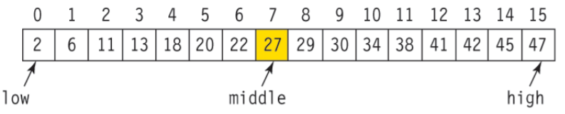
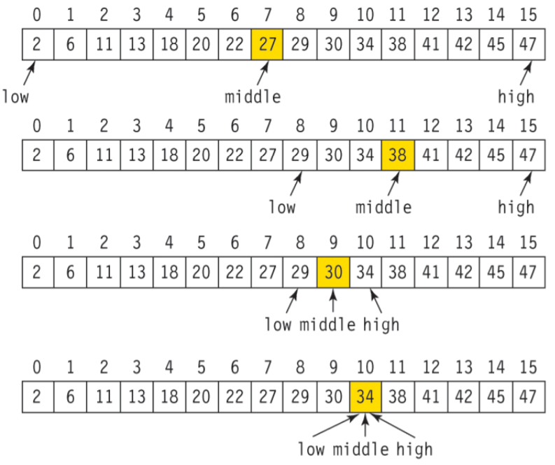

### 이진탐색 (Binart Search) 알고리즘

> 친구가 이진탐색이 재밌다고 알려준대서 배워봤는데 ~~진짜 재밌었다~~. 잊기 전에 정리해보자!

### 목차
- [이진탐색 (Binart Search) 알고리즘](#이진탐색-binart-search-알고리즘)
- [목차](#목차)
- [이진 탐색 / 이분 탐색이 뭔데요](#이진-탐색--이분-탐색이-뭔데요)
- [준비물](#준비물)
- [방법](#방법)
- [예제 코드](#예제-코드)
- [실습](#실습)

### 이진 탐색 / 이분 탐색이 뭔데요
- **정렬되어 있는(중요)** 배열에서 데이터 찾으려 시도할 때 탐색 범위를 절반씩 줄여가며 찾는 탐색 방법

- BigO : o(log N)
- 정렬된 자료를 반으로 나누어 탐색하는 방법
- 값의 대소를 비교해 위치를 찾는 방식이므로 정렬되어 있어야 한다.

### 준비물
- `data` : 오름차순으로 정렬된 list
- `target` : 찾고자 하는 값
- `low` : data의 처음 값 인덱스
- `high` : data의 마지막 값 인덱스
- `middle` : start, end의 중간 인덱스 (`(low + high) // 2`)

### 방법

1. 자료의 중앙(`middle`)에 `target`이 저장되어 있는지 확인 값이 같다면 탐색 완료
2. 아닐 경우 `target`값과 `data[middle]`을 비교하여 어느 쪽이 더 큰지 알아낸다
   1. `data[middle]`보다 작다면 앞부분만 탐색하도록 `high` 값 조정
   2. `data[low]`보다 작다면 뒷부분만 탐색하도록 `low`값 조정  
```python
if target < data[middle]:
    high = middle - 1
elif target > data[middle]:
    low = middle + 1
```

3. 1, 2의 과정 반복



:warning: low >= high일 경우 리스트에 찾는 값이 없는 것으로 보고 탐색이 종료되어야 한다.

  
### 예제 코드
```python
data = [i**2 for i in range(11)]  # 테스트용 리스트
target = 9
low = 0
high = len(data) - 1

while low <= high:
    middle = ((low + high) // 2)
    if data[middle] == target:
        break
    if target < data[middle]:
        high = middle - 1
    elif target > data[middle]:
        low = middle + 1

print(data[middle])
```

### 실습
- [백준 1654. 랜선 자르기](https://github.com/hyundol2/algorithm/tree/main/%EB%B0%B1%EC%A4%80/Silver/1654.%E2%80%85%EB%9E%9C%EC%84%A0%E2%80%85%EC%9E%90%EB%A5%B4%EA%B8%B0)